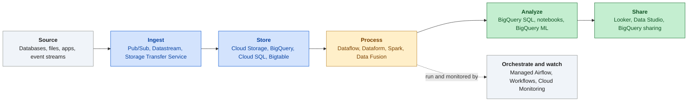

# Start here

Part of the [handbook](README.md). Practice questions and the interactive version: [ADP Study Hub](https://claude.ai/artifact/BKoxgMe73TZksDEshXkXGY).

**In this chapter**

- [The exam in one screen](#s-exam-overview)
- [How to use this handbook](#s-how-to-use)
- [2026 product renames](#s-renames)
- [Patterns in practice questions](#s-patterns)

## The exam in one screen

The Associate Data Practitioner exam tests whether you can prepare, load, analyze, orchestrate and protect data with Google Cloud services. Google describes the candidate as someone who already knows the basics of IaaS, PaaS and SaaS. The certification page recommends about 6 months of hands-on work with data on Google Cloud, but there is no formal prerequisite. It also lists a 2 hour exam of 50 to 60 questions, a mix of multiple choice and multiple select. Google does not publish the pass mark, so aim to be solid in every domain instead of chasing a number. The weights below are approximate.

**The data journey on Google Cloud**

*Find the stop a question is about, then pick the product that belongs there.*

| Domain | Weight | What it asks of you | Chapter |
|---|---|---|---|
| 1. Data preparation and ingestion | about 30% | Pick formats, storage, transfer and loading tools; clean and check data | [see](01-data-preparation-and-ingestion.md) |
| 2. Data analysis and presentation | about 27% | Query in BigQuery, build dashboards, train simple ML models | [see](02-analysis-and-presentation.md) |
| 3. Data pipeline orchestration | about 18% | Choose transformation tools, schedule, automate and monitor | [see](03-pipeline-orchestration.md) |
| 4. Data management | about 25% | Access control, storage lifecycle, recovery, encryption, sharing | [see](04-data-management.md) |

> [!WARNING]
> **Common trap.** Skipping the smallest domain. Orchestration is about 18%, which is still roughly one question in five or six, and its tool choices come up inside the other domains too.

**Read more in the Google Cloud docs**

- [Official certification page](https://cloud.google.com/learn/certification/data-practitioner)
- [Official exam guide (PDF)](https://services.google.com/fh/files/misc/v1.0_associate_data_practitioner_exam_guide_english.pdf)

## How to use this handbook

Read one chapter, then test yourself. The practice questions are in the [ADP Study Hub](https://claude.ai/artifact/BKoxgMe73TZksDEshXkXGY), which also has this handbook with interactive pictures. Start with Practice set 1 as a warm-up. After that, do sets 2 to 4, ideally on different days, and give each one a full 2 hours. When a set ends, every question you missed or guessed links back to the handbook section that teaches the deciding fact. Read that section, then move on.

| Practice set | What it is like | Use it for |
|---|---|---|
| Set 1 | Warm-up, short questions | Getting used to the topics |
| Set 2 | Longer scenario questions | A first honest check |
| Set 3 | The hardest set | Stretching yourself; a lower score here is normal |
| Set 4 | Shorter scenarios, full-plan options | A final check of what you know |

> [!TIP]
> **Tip.** Do not memorize answers. Each practice question has a short reason for every option, so read why the wrong ones fail. That is what carries over to new questions.

## 2026 product renames

Google renamed several products in 2024 to 2026. The services behave as before; only the labels changed. The official exam guide still uses some old names (it says Cloud Composer, Dataproc, Analytics Hub, Looker Studio and Cloud Functions), while current docs and consoles use the new ones. Questions can use either, so learn both. This handbook writes the new name and puts the old one in brackets the first time it appears in a section.

| New name | Used to be | Note |
|---|---|---|
| Managed Service for Apache Spark | Dataproc, Dataproc Serverless, Serverless for Apache Spark | Covers clusters and serverless; Dataproc workflow templates are now Managed Service for Apache Spark workflow templates |
| Managed Service for Apache Airflow | Cloud Composer | Same Airflow orchestration service |
| Knowledge Catalog | Dataplex (later Dataplex Universal Catalog) | Renamed in April 2026; API and IAM names stayed the same |
| Data Studio | Looker Studio | Renamed back in April 2026; free dashboard tool |
| Agent Platform | Vertex AI | Full name Gemini Enterprise Agent Platform; AutoML and Model Registry now sit under it |
| Lakehouse | BigLake | Renamed in April 2026; BigLake metastore is now the Lakehouse runtime catalog |
| BigQuery sharing | Analytics Hub | Publishes datasets to other teams or organizations without copying |
| Cloud Run functions | Cloud Functions | Small event-driven code, the usual target of an Eventarc trigger |

Looker is a different product from Data Studio. Looker is the governed enterprise BI platform built on LookML; Data Studio is the lighter self-service tool.

> [!WARNING]
> **Common trap.** Reading Data Studio as the same thing as Looker because the names look related. They are separate products: Looker is built around a shared LookML data model, while Data Studio is a free, lighter tool. The Looker chapter compares them.

**Read more in the Google Cloud docs**

- [Managed Service for Apache Spark](https://docs.cloud.google.com/dataproc/docs)
- [Managed Service for Apache Airflow](https://docs.cloud.google.com/composer/docs)
- [Knowledge Catalog](https://docs.cloud.google.com/dataplex/docs/introduction)
- [Welcome to Data Studio](https://docs.cloud.google.com/data-studio/welcome)
- [BigQuery sharing](https://docs.cloud.google.com/bigquery/docs/analytics-hub-introduction)

## Patterns in practice questions

Most scenario questions follow one shape: a short situation, a need, one or two constraints written as qualifier words, and four options where two or three could work in real life. The qualifier decides which one is the best answer. So read the constraint first, then the options. Wrong options are usually the right tool at the wrong size: too big, too much code, too many copies, or too much access.

| If the question says | It usually points to | Why |
|---|---|---|
| Most efficient, minimize complexity | The dedicated service built for exactly that job | Every extra product is another thing to set up and run |
| Fully managed, serverless | BigQuery, Dataflow, Pub/Sub, scheduled queries | No servers or clusters to size and patch |
| Least privilege | A predefined role at the narrowest scope that works | Basic roles and project-wide grants give too much |
| Cost-effective | Matching storage class, expiry, partitioning, no extra copies | You pay for what you store, scan and move |
| Minimal downtime | Continuous replication or change capture | One big copy needs a cutover window |
| Real-time | Pub/Sub with streaming Dataflow or a BigQuery subscription | Nightly batch is too late |
| Without custom code | Console-configured tools and ready-made templates | Scripts and functions are code you must maintain |
| Survive a region loss | Dual-region or multi-region Cloud Storage bucket (a BigQuery multi-region dataset is the exception, see [location types](01-data-preparation-and-ingestion.md#s-location-types)) | A single region fails together |

Rules of thumb, each with a fresh example:

1. **Dedicated service first when nothing needs changing.** Moving a MySQL database to Cloud SQL as it is points to Database Migration Service, not a hand-built Dataflow job.
2. **Managed Service for Apache Airflow (used to be Cloud Composer) only for chains.** It runs workflows written in Python, see [orchestrators](03-pipeline-orchestration.md#s-orchestrators). Export a file, run Dataflow, run a query, send a notice, with retries and branches: Airflow. One nightly SQL statement: a scheduled query.
3. **Custom code usually loses.** A script on a virtual machine polling for files loses to a managed trigger. The exception is a single small action that fires on an event, such as a Cloud Run function (used to be Cloud Functions).
4. **Query data in place.** A Parquet file sitting in Cloud Storage can be queried through BigQuery as it is, using an external table that points at the file; exporting it to a spreadsheet to analyze it is the wrong answer.
5. **ELT is the usual answer.** Load the raw data into BigQuery, then transform it with SQL or Dataform (a tool that runs chained SQL steps inside BigQuery). Choose ETL only when something must be removed or changed before it is stored, such as card numbers that must never be written.
6. **Narrowest role, lowest scope.** An analyst who reads one dataset gets BigQuery Data Viewer on that dataset, not Editor on the project.
7. **Match the store to how data is read.** Rarely read but still queried: leave it in BigQuery, where storage gets cheaper after 90 untouched days. Kept for audit and never queried: Archive class in Cloud Storage plus a lifecycle rule.
8. **Pub/Sub into BigQuery as is: BigQuery subscription** (a Pub/Sub setting that writes each message straight into a table). If messages must be reshaped on the way, use Dataflow.
9. **Train where the data lives.** Labeled table data already in BigQuery goes to BigQuery ML before anything is exported to another ML tool.

> [!TIP]
> **Tip.** When two options both work, find the one phrase in the question that rules one out: a size, a deadline, "no code", "already in BigQuery", "must survive a region failure". Multiple select questions say how many answers to choose, so read that line twice.

---

Next: [Domain 1: Data preparation and ingestion](01-data-preparation-and-ingestion.md)
