# Domain 1: Data preparation and ingestion

Part of the [handbook](README.md). Practice questions and the interactive version: [ADP Study Hub](https://claude.ai/artifact/BKoxgMe73TZksDEshXkXGY).

**In this chapter**

- [Structured, semi-structured and unstructured data](#s-data-types)
- [File formats: CSV, JSON, NDJSON, Avro, Parquet](#s-file-formats)
- [Where data lives: storage and database products](#s-storage-products)
- [Location types: zonal, regional, dual-region, multi-region](#s-location-types)
- [Data lake, warehouse and lakehouse](#s-lake-warehouse)
- [Getting data in: transfer and loading tools](#s-transfer-tools)
- [ETL, ELT and ETLT](#s-etl-elt)
- [Processing tools: Dataflow, Spark, Data Fusion, Dataform](#s-processing-tools)
- [Streaming with Pub/Sub and into BigQuery](#s-streaming)
- [Data quality and cleaning](#s-data-quality)

<a id="s-data-types"></a>

## Structured, semi-structured and unstructured data

Every storage question starts with the shape of the data. **Structured** data has fixed columns with set types, and every row looks the same: an orders table. **Semi-structured** data carries its own labels (keys or tags), but the shape can change from record to record: JSON website events, where one event has a `coupon` field and the next does not. **Unstructured** data has no fields a database can read directly: photos, PDFs, audio, video.

To classify a use case, ask one question: could you list the columns before you see the data? Yes means structured. Only the keys, and they vary, means semi-structured. Neither means unstructured.

| Use case | Class | Natural home |
|---|---|---|
| Orders with fixed columns | Structured | BigQuery (analysis), Cloud SQL (app) |
| A CSV export of invoices | Structured | BigQuery |
| Click events as JSON, fields vary | Semi-structured | BigQuery (JSON or nested columns), Firestore |
| Application logs in JSON | Semi-structured | BigQuery, Cloud Storage |
| XML documents | Semi-structured | Cloud Storage; parse them before loading to BigQuery |
| Product photos, scanned contracts | Unstructured | Cloud Storage |
| Call recordings, video | Unstructured | Cloud Storage |

> [!WARNING]
> **Common trap.** JSON is not unstructured, because it has keys that SQL can query. Also, where a file sits does not change its class: a CSV in a bucket is still structured.

**Read more in the Google Cloud docs**

- [Cloud Storage overview](https://docs.cloud.google.com/storage/docs/introduction)
- [Load data into BigQuery](https://docs.cloud.google.com/bigquery/docs/loading-data)

<a id="s-file-formats"></a>

## File formats: CSV, JSON, NDJSON, Avro, Parquet

A file format decides three things: whether the file carries its own schema, how it is laid out, and whether BigQuery loads it without help. **CSV** and **JSON** are text. They hold values but no declared types, so BigQuery has to guess them (schema auto-detection) or you supply the schema. **Avro** and **Parquet** are binary and self-describing: the exact column types are stored inside the file, so BigQuery just reads them. Parquet is **columnar**, which suits queries that read a few columns. Avro stores whole rows, and handles nested and repeated fields.

| Format | Schema inside the file? | BigQuery load | Pick when |
|---|---|---|---|
| CSV | No | Auto-detect or you give a schema | Simple flat tables, spreadsheet exports |
| JSON (one big array) | Keys only | Will not load | Avoid for loads; convert it |
| NDJSON (one object per line) | Keys only | Loads; auto-detect works | Nested data, no binary format available |
| Avro | Yes, exact types | Schema read from the file | Pipelines and exchange, nested fields, no manual schema |
| Parquet | Yes, exact types | Schema read from the file | Analytics on a few columns, lake files |

> [!TIP]
> **Tip.** CSV cannot hold nested or repeated fields. If a question mentions nested line items and a schema nobody maintains, think Avro.

> [!WARNING]
> **Common trap.** Plain JSON is not newline-delimited JSON. A file holding one array of objects fails a BigQuery load; each line must be one complete object.

**Read more in the Google Cloud docs**

- [Loading newline-delimited JSON](https://docs.cloud.google.com/bigquery/docs/loading-data-cloud-storage-json)
- [Loading Avro data](https://docs.cloud.google.com/bigquery/docs/loading-data-cloud-storage-avro)
- [Loading Parquet data](https://docs.cloud.google.com/bigquery/docs/loading-data-cloud-storage-parquet)

<a id="s-storage-products"></a>

## Where data lives: storage and database products

Choose by two things: what the data looks like, and what the workload does. A workload is either **analytical** (few huge scans and aggregations) or **transactional** (many small, fast reads and writes). Cloud Storage keeps files as objects. BigQuery is the serverless warehouse for analysis. The rest are databases for applications: Cloud SQL, AlloyDB and Spanner are relational, Bigtable is wide-column, and Firestore is a document store.

**Which storage or database?**

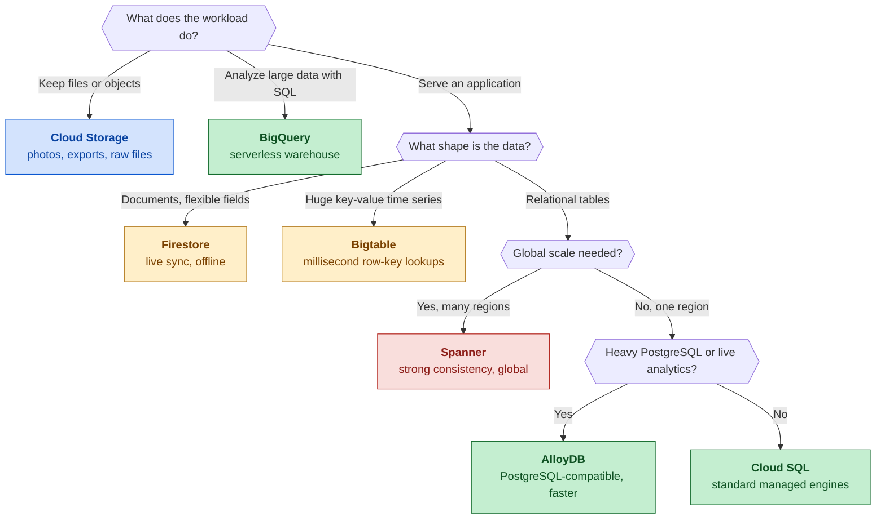

*Follow the questions from the top to land on one product.*

| Product | What it is | Choose it when |
|---|---|---|
| Cloud Storage | Object store for files | Raw files, images, backups, a data lake |
| BigQuery | Serverless SQL warehouse | Reports and analysis over large data |
| Cloud SQL | Managed MySQL, PostgreSQL, SQL Server | A standard app database, familiar engine |
| AlloyDB | PostgreSQL-compatible, faster | PostgreSQL apps that outgrow Cloud SQL, or analytics on live data |
| Spanner | Relational with horizontal scale | Strong consistency at global scale, writes in many regions |
| Bigtable | Wide-column NoSQL | Huge write volume, millisecond lookups by row key, time series |
| Firestore | Serverless document database | Mobile and web apps, flexible fields, live sync, offline use |

> [!TIP]
> **Tip.** Scanning versus looking up decides most of these. BigQuery scans billions of rows to answer a question. Bigtable fetches one key in milliseconds. Do not swap them.

> [!WARNING]
> **Common trap.** Picking the biggest product "to be safe". Spanner for a regional app that Cloud SQL handles costs more and adds nothing. Match the product to the stated need.

**Read more in the Google Cloud docs**

- [Cloud SQL overview](https://docs.cloud.google.com/sql/docs/introduction)
- [AlloyDB overview](https://docs.cloud.google.com/alloydb/docs/overview)
- [Bigtable overview](https://docs.cloud.google.com/bigtable/docs/overview)

<a id="s-location-types"></a>

## Location types: zonal, regional, dual-region, multi-region

A **zone** is one isolated deployment area. A **region** is a geographic place made of several zones. A **dual-region** is two chosen regions. A **multi-region** is a large area holding two or more regions. The wider the footprint, the bigger the failure it survives. In Cloud Storage the price per stored GB runs from cheapest to dearest like this: region, multi-region, dual-region. So pick the cheapest option that still meets the recovery need the question states. Keep data in the same region as the compute that reads it.

**Location types and what survives**

Top row: Survives a bigger failure. Bottom row: Survives a smaller failure.

|  | What it is | Note |
|---|---|---|
| **Multi-region** | large area, two or more regions | region outage |
| **Dual-region** | two chosen regions, optional turbo | region outage |
| **Region** | copies across its zones | zone outage |
| **Zone** | one isolated deployment area | no protection |

*Choose the smallest rung that meets the stated recovery need.*

| Option | Survives | Where it applies |
|---|---|---|
| Zone | Nothing beyond that zone | Cloud Storage zonal buckets; a Cloud SQL instance without high availability |
| Region | A zone outage | Cloud Storage regional bucket, lowest storage price; BigQuery regional dataset |
| Dual-region | A region outage | Cloud Storage buckets (Spanner has a few dual-region setups). Replication is asynchronous; turbo replication targets 15 minutes |
| Multi-region | A region outage (Cloud Storage) | Cloud Storage: price between region and dual-region. BigQuery: US or EU, but see the trap |

> [!TIP]
> **Tip.** In BigQuery, you set the dataset location when you create it and cannot change it later. Loading or querying data from a bucket in another location adds transfer charges, so colocate the two.

> [!WARNING]
> **Common trap.** A BigQuery multi-region dataset does not give regional redundancy, because the data is stored in a single region. For region-loss protection in Cloud Storage, use a dual-region or multi-region bucket.

**Read more in the Google Cloud docs**

- [Cloud Storage locations](https://docs.cloud.google.com/storage/docs/locations)
- [BigQuery locations](https://docs.cloud.google.com/bigquery/docs/locations)

<a id="s-lake-warehouse"></a>

## Data lake, warehouse and lakehouse

A **data lake** keeps raw data of any kind, usually as files in Cloud Storage, and applies structure only when you read it. A **data warehouse** holds cleaned, modelled tables with a schema fixed at load time, built for fast SQL: BigQuery. A **lakehouse** puts warehouse features (tables, SQL, governance) on top of lake files, so one copy of the data serves both. Lakes are cheap and flexible. Warehouses are fast and trusted. Lakehouses try to give you both. On Google Cloud, "Lakehouse" is also a product name (see the note below).

**Lake, warehouse, lakehouse**

| Data lake | Data warehouse | Lakehouse |
|---|---|---|
| Raw files, any format | Modelled tables | Open files plus tables |
| Schema applied on read | Schema set on write | Governance on top |
| Cheap, flexible | Fast, trusted SQL | One copy, many engines |
| Cloud Storage | BigQuery | Lakehouse (was BigLake) |

*A lakehouse gives lake files warehouse-style tables.*

| Question | Lake | Warehouse | Lakehouse |
|---|---|---|---|
| What goes in | Any raw data | Structured, modelled | Files, with table structure |
| When is the schema set | On read | On write | Table format adds it |
| Typical Google Cloud home | Cloud Storage | BigQuery | Cloud Storage files with tables on top |
| Main strength | Cheap, any format | Fast, reliable SQL | One copy, many engines |
| Main weakness | Messy without rules | Needs prepared data | More moving parts |

> [!NOTE]
> **Beyond the exam guide.** Apache Iceberg is an open table format: a way to describe a set of files as one table. Lakehouse (used to be BigLake, renamed in April 2026) lets BigQuery and open source engines such as Spark and Trino work on the same Iceberg tables stored in Cloud Storage. You may still see it called BigLake.

> [!WARNING]
> **Common trap.** "Lake" does not mean "unstructured only". A lake holds anything, including CSV and Parquet. The difference is when the schema is applied, not what the files contain.

**Read more in the Google Cloud docs**

- [Lakehouse introduction](https://docs.cloud.google.com/lakehouse/docs/introduction)
- [BigLake tables and the Lakehouse rename](https://docs.cloud.google.com/biglake/docs/biglake-tables)

<a id="s-transfer-tools"></a>

## Getting data in: transfer and loading tools

Four things decide how data gets into Google Cloud: what the source is, how much data there is, how fast your network is, and whether the move happens once or on a schedule. Files go to Cloud Storage with `gcloud storage`, Storage Transfer Service or Transfer Appliance. A file you already hold goes into BigQuery with `bq load`. SaaS apps and other clouds feed BigQuery on a schedule through BigQuery Data Transfer Service. Databases are either moved with Database Migration Service or followed change by change with Datastream.

**Which transfer tool?**

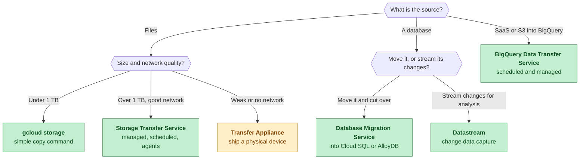

*Start from what the source is, then ask about size, network and schedule.*

For files, size and bandwidth decide. Below roughly 1 TB, `gcloud storage` is enough: one command, no setup. Above that, **Storage Transfer Service** is built for the job. It reads from Amazon S3, Azure Blob Storage, public URLs, other buckets and on-premises file systems, and it can run on a schedule. For on-premises sources you install **agents**, which are small programs that run on your own servers and do the copying. If the network is weak or missing, **Transfer Appliance** is the answer, whatever the size: Google ships you a storage device, you fill it, send it back, and Google loads the data into Cloud Storage.

To get a file into a BigQuery table, use `bq load` (or the console, or a client library in code). It reads CSV, newline-delimited JSON, Avro, Parquet and ORC. **BigQuery Data Transfer Service** is different: it pulls from sources such as Google Ads, YouTube, Salesforce, Amazon S3, Azure Blob Storage and Teradata into BigQuery on a schedule you set, with no code and with backfills when a run was missed.

For databases, the question is whether you are moving the database or feeding analytics. **Database Migration Service** copies a snapshot of a live database into Cloud SQL or AlloyDB, keeps replicating changes while the source stays online, and lets you cut over with little downtime. Once the application runs on the new database, **Datastream** can stream its changes to BigQuery for reporting.

**Live database move and sync**

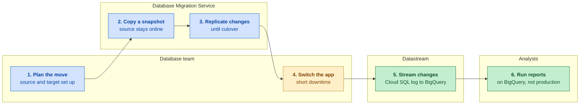

*One tool moves the live database, another streams its changes to reporting.*

Datastream is a serverless change data capture (CDC) service. CDC means reading the database's own log of inserts, updates and deletes instead of repeatedly querying the tables. Datastream first backfills the existing rows, then follows the log. It reads sources such as MySQL, PostgreSQL, Oracle and SQL Server, and writes to BigQuery or Cloud Storage. The data lands in the destination.

**Datastream change data capture**

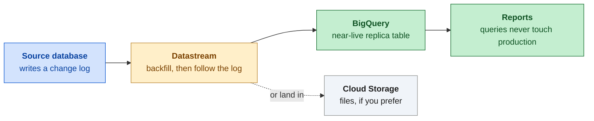

*First a backfill of existing rows, then every change follows.*

| Tool | Source | Destination | Pick it when |
|---|---|---|---|
| `gcloud storage` | Local disk, on-premises files, another bucket | Cloud Storage | Under about 1 TB, quick copy |
| `bq load` or a client library | A file you already have | BigQuery | One load of CSV, JSON, Avro or Parquet |
| Storage Transfer Service | S3, Azure, URLs, buckets, on-premises file systems (agents) | Cloud Storage | Over 1 TB, recurring, or from another cloud |
| Transfer Appliance | On-premises data | Cloud Storage | Weak or no network, or a huge volume |
| BigQuery Data Transfer Service | SaaS apps, Google services, S3, Azure | BigQuery | Scheduled loads with no code |
| Database Migration Service | A live source database | Cloud SQL, AlloyDB | Move a database with little downtime |
| Datastream | MySQL, PostgreSQL, Oracle, SQL Server | BigQuery, Cloud Storage | Every change must reach analytics |

> [!WARNING]
> **Common trap.** Database Migration Service and Datastream both follow database changes, so people swap them. Moving the application's database to Cloud SQL or AlloyDB is Database Migration Service. Feeding changes to BigQuery for reporting is Datastream.

**Read more in the Google Cloud docs**

- [Data transfer options](https://docs.cloud.google.com/storage-transfer/docs/transfer-options)
- [BigQuery Data Transfer Service overview](https://docs.cloud.google.com/bigquery/docs/dts-introduction)
- [Datastream overview](https://docs.cloud.google.com/datastream/docs/overview)

<a id="s-etl-elt"></a>

## ETL, ELT and ETLT

ETL, ELT and ETLT name the order of three steps: extract (read from the source), transform (clean, reshape, join) and load (write to the destination). In **ETL**, the data is changed before it is stored. In **ELT**, you load the raw data first and change it inside the warehouse, with SQL in BigQuery. **ETLT** makes a small change before loading, then does the main work after. Google recommends ELT for most cases, because BigQuery runs large transformations in SQL and you need no separate processing tool.

**ETL, ELT and ETLT compared**

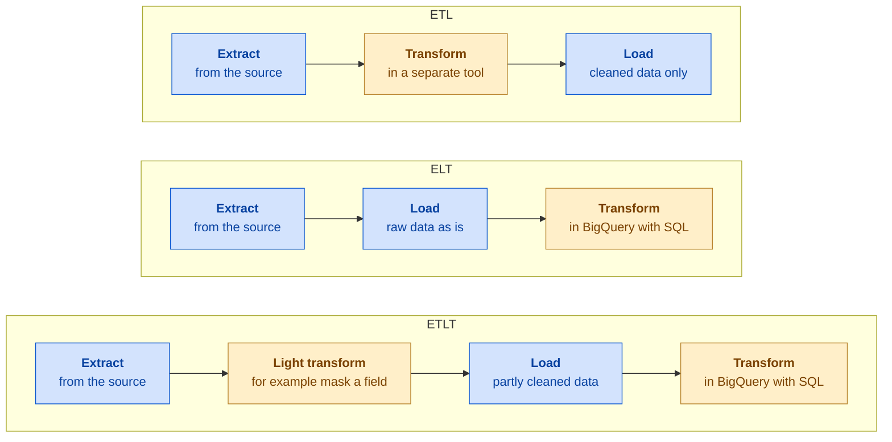

- **ETL.** Pick it when: Data must change before it is stored
- **ELT.** Pick it when: The usual Google answer
- **ETLT.** Pick it when: Small fix first, the rest in SQL

*The amber step is where the data is changed.*

A typical ELT job: a shop exports its sales as a CSV file each night. You load it unchanged into a raw table, then a scheduled query or a Dataform workflow builds a clean summary table that the dashboard reads. The raw copy stays in BigQuery, so if the SQL had a mistake you fix it and rebuild without asking the source again.

**Daily sales files to dashboard**

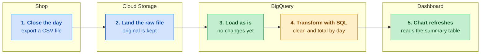

*A shop's daily export is loaded untouched, then turned into a summary table with SQL.*

ETL is right when something must change before the data is stored. The usual example is personal data: if names or card numbers must never land in the warehouse, they have to be removed or masked on the way in. Filtering out bad or malicious input, or reusing a transformation process that already exists outside the cloud, are the same kind of reason. Dataflow and Data Fusion are the usual tools for that step. ETLT fits when only one thing has to happen early, such as masking a field, and everything else can be SQL after the load.

| Clue in the question | Pattern | Tool that fits |
|---|---|---|
| Analysts write SQL, no special need | ELT | BigQuery SQL, Dataform, scheduled queries |
| Keep the raw data for later reprocessing | ELT | Load first, transform in BigQuery |
| Personal data must not be stored | ETL | Dataflow or Data Fusion before the load |
| Mask one field, then reshape in SQL | ETLT | Dataflow, then BigQuery SQL |
| Existing transformation logic outside BigQuery | ETL | Data Fusion or Dataflow |
| Live events that must be changed on arrival | ETL style | Dataflow (see the streaming section) |

> [!WARNING]
> **Common trap.** Choosing ETL just because the question mentions "transform". If nothing has to change before the data is stored, the answer is ELT: load first, then transform in BigQuery.

**Read more in the Google Cloud docs**

- [Introduction to loading, transforming, and exporting data](https://docs.cloud.google.com/bigquery/docs/load-transform-export-intro)
- [What is ELT?](https://cloud.google.com/discover/what-is-elt)

<a id="s-processing-tools"></a>

## Processing tools: Dataflow, Spark, Data Fusion, Dataform

Pick the tool that matches how the work is built. **BigQuery SQL** transforms data that is already in BigQuery. **Dataform** organizes many SQL steps into one workflow. **Dataflow** runs Apache Beam pipelines for batch and streaming without servers to manage. **Managed Service for Apache Spark (used to be Dataproc)** runs Spark and Hadoop jobs (both are open-source big-data frameworks), which fits when code already exists. **Cloud Data Fusion** builds pipelines by dragging and connecting boxes.

**Which processing tool?**

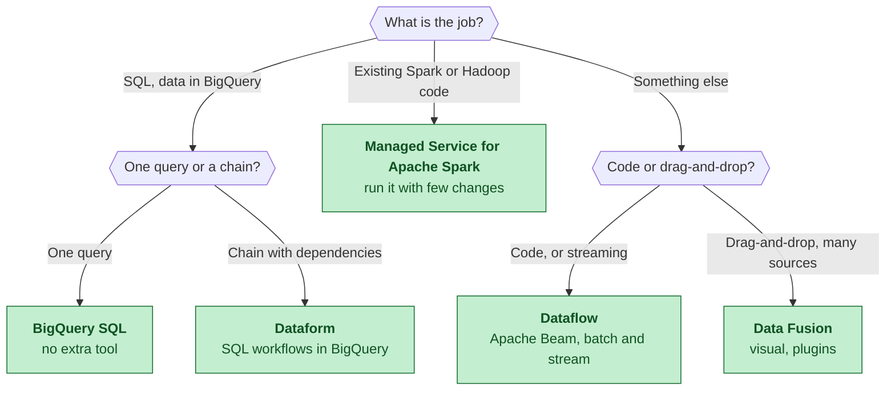

*Ask where the data is and how you want to build the transform.*

**Dataflow** is a fully managed service that runs pipelines written with Apache Beam, an open-source model with Java, Python and Go SDKs. The same pipeline logic works on a bounded batch or an endless stream, and Dataflow spreads the work across machines and scales them for you. A **template** packages a pipeline so you can run it from a form, the CLI or the API without a development setup. Google provides ready-made templates for common jobs, for example Pub/Sub to BigQuery. You watch a running job in the Dataflow job graph.

**Anatomy of a Dataflow pipeline**

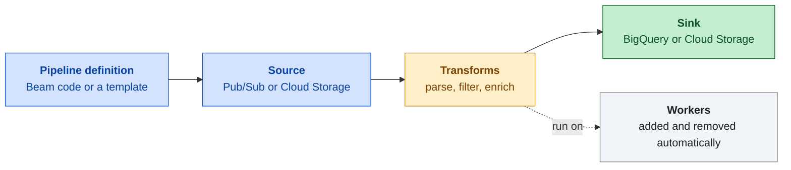

*You define the steps; Dataflow runs them on machines it scales for you.*

**Managed Service for Apache Spark** gives you managed Spark and Hadoop, on clusters or serverless. **Managed Service for Apache Spark workflow templates (used to be Dataproc workflow templates)** define a graph of jobs with dependencies; when run, the template can create a temporary cluster, run every job and delete the cluster. It suits a fixed chain of jobs that all run on Spark.

**Cloud Data Fusion** is a visual data integration service built on the open-source CDAP project. Plugins cover sources, transforms and sinks, and pipelines can be batch or real-time. At the start of each run it creates a temporary Managed Service for Apache Spark cluster in your project, runs the pipeline there and deletes the cluster. You create a Data Fusion instance (Developer, Basic or Enterprise edition) to host the designer. Its Wrangler screen cleans sample data by clicking.

**What Data Fusion is**

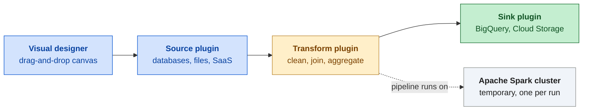

*You draw the pipeline; each run uses a temporary Spark cluster.*

**Dataform** turns SQL files with a small settings block (SQLX) into a workflow inside BigQuery. A `ref` function names the table a step depends on, so Dataform works out the run order itself. It also offers assertions to test data (for example, no nulls), git integration and scheduling. It transforms data that is already loaded, so it is ELT, not a loading tool.

| Tool | You build with | Best for | Poor fit |
|---|---|---|---|
| BigQuery SQL | SQL | Transforming data already in BigQuery | Streaming, logic SQL cannot express |
| Dataform | SQLX files in git | Chains of dependent SQL steps, tests, schedules | Moving data into BigQuery |
| Dataflow | Beam code or a template | Streaming, batch and stream together, custom logic | A job one SQL query can do |
| Managed Service for Apache Spark | Spark or Hadoop code | Existing Spark jobs with few changes | New SQL-only work |
| Data Fusion | Drag and drop | No code, many connectors, ETL | A quick SQL transformation |

> [!WARNING]
> **Common trap.** Reaching for Dataflow when the data is already in BigQuery and SQL can do the job. SQL, with Dataform for a chain of steps, is the simpler answer.

**Read more in the Google Cloud docs**

- [Dataflow overview](https://docs.cloud.google.com/dataflow/docs/overview)
- [Cloud Data Fusion overview](https://docs.cloud.google.com/data-fusion/docs/concepts/overview)
- [Dataform overview](https://docs.cloud.google.com/dataform/docs/overview)

<a id="s-streaming"></a>

## Streaming with Pub/Sub and into BigQuery

Pub/Sub is a messaging service that sits between the things that produce events and the things that use them. A **publisher** sends messages to a **topic**. Each **subscription** attached to the topic gets its own copy of every message, and a **subscriber** reads them through that subscription. After handling a message, the subscriber sends an **acknowledgement** (ack). If no ack arrives before the ack deadline, Pub/Sub delivers the message again, so subscribers must cope with duplicates.

**Pub/Sub basics**

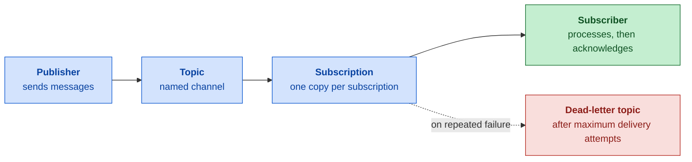

*A subscription delivers the topic's messages, and failed ones can be parked.*

Some messages fail every time, for example one that does not fit the BigQuery table. Pub/Sub would keep redelivering it. To react, set a **dead-letter topic** on the subscription. After a chosen number of delivery attempts (5 to 100, default 5), Pub/Sub forwards the message there with attributes that say where it came from. For BigQuery subscriptions the attributes also hold the error message, so you can see why it failed. The Pub/Sub service account needs permission to publish to that topic and to subscribe on the source subscription.

There are three ways from Pub/Sub into BigQuery. Use a **BigQuery subscription** when no transformation is needed: Pub/Sub writes the rows directly, with the fewest parts. Use the **Google-provided Dataflow template** when a light transformation is needed and you want no pipeline code (Dataflow is the managed pipeline service). Use a **custom Dataflow pipeline** for complex logic such as joins or time windows (grouping events by a span of time).

**Three ways into BigQuery**

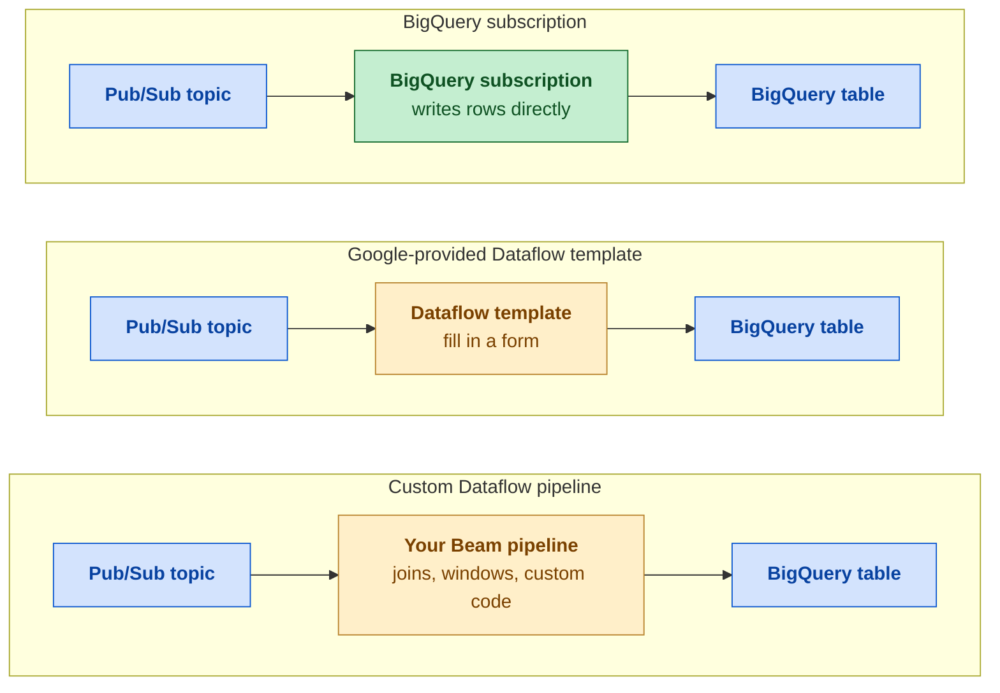

- **BigQuery subscription.** Pick it when: No transformation needed
- **Google-provided Dataflow template.** Pick it when: Light transformation, no pipeline code
- **Custom Dataflow pipeline.** Pick it when: Complex logic

*No change, light change, or complex logic: three lanes, three tools.*

Clicks on a website are events the page emits, so they travel through Pub/Sub, not Datastream: Datastream is for rows that change in a database.

**Website clicks to live dashboard**

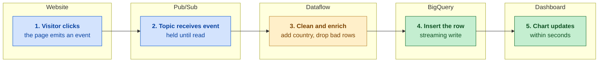

*Each click becomes a message, is cleaned in flight and appears in BigQuery within seconds.*

| Need | Use | Note |
|---|---|---|
| Messages fit the table, no change | BigQuery subscription | No code, fewest components |
| Light change, no code to write | Google-provided Dataflow template | Fill in a form; optional small function |
| Complex logic, enrichment, windows | Custom Dataflow pipeline | Beam code |
| Messages keep failing | Dead-letter topic on the subscription | Failed messages are kept for review |
| Subscriber crashed or was slow | Redelivery after the ack deadline | Handle duplicates |
| App emits an event | Pub/Sub | Clicks, logs, sensor readings |
| A database row changes | Datastream | Not Pub/Sub |

> [!WARNING]
> **Common trap.** Answering "messages keep failing" with more subscribers or more capacity. The fix that captures the failed messages and the reason is a dead-letter topic.

**Read more in the Google Cloud docs**

- [Pub/Sub overview](https://docs.cloud.google.com/pubsub/docs/overview)
- [Dead-letter topics](https://docs.cloud.google.com/pubsub/docs/dead-letter-topics)
- [BigQuery subscriptions](https://docs.cloud.google.com/pubsub/docs/bigquery)

<a id="s-data-quality"></a>

## Data quality and cleaning

To assess quality, Knowledge Catalog (used to be Dataplex) offers two scans on BigQuery tables. A **profile scan** describes the data: null percentage, distinct values, min, max, top values. It has no rules and no pass or fail. A **quality scan** checks rules you define (not null, unique, in range, matches a pattern, custom SQL), gives pass or fail, runs on a schedule and can alert. Profile to learn, then write rules.

To clean in BigQuery, use SQL. NULL means "no value". `SAFE_CAST` returns NULL instead of an error on a bad value, and `AVG` ignores NULLs. To remove duplicates, `ROW_NUMBER` (a window function, which numbers rows within a group) numbers the rows for each key, newest first. `QUALIFY` is a filter that runs on window function results, so it keeps only row 1.

```sql
SELECT order_id,
  SAFE_CAST(amount AS NUMERIC) AS amount,
  COALESCE(NULLIF(TRIM(country), ''), 'unknown') AS country
FROM raw.orders
WHERE order_id IS NOT NULL
QUALIFY ROW_NUMBER() OVER (
  PARTITION BY order_id
  ORDER BY loaded_at DESC) = 1;
```

For no-code cleaning, Cloud Data Fusion has Wrangler, a visual tool. For very large or streaming data, use Dataflow.

| Need | Use |
|---|---|
| See null rates and value spread | Profile scan |
| Pass or fail rules with alerts | Quality scan |
| Text that may not convert to a number | `SAFE_CAST` |
| Exact duplicate rows | `SELECT DISTINCT` |
| Keep the latest row per key | `ROW_NUMBER` ... `DESC` with `QUALIFY` |
| List keys that repeat | `GROUP BY` key `HAVING COUNT(*) > 1` |
| Missing values | `COALESCE` (first non-NULL value), or leave as NULL |
| Cleaning outside SQL | Data Fusion Wrangler (visual), Dataflow (huge or streaming) |

> [!WARNING]
> **Common trap.** Do not replace unknown values with 0 to make a query run. The zeros count as real values and drag an average down. Use NULL, which aggregates skip.

**Read more in the Google Cloud docs**

- [Data profile scans](https://docs.cloud.google.com/dataplex/docs/data-profiling-overview)
- [Auto data quality](https://docs.cloud.google.com/dataplex/docs/data-quality-overview)
- [Wrangler overview](https://cloud.google.com/data-fusion/docs/concepts/wrangler-overview)

---

Previous: [Start here](00-start-here.md) | Next: [Domain 2: Analysis and presentation](02-analysis-and-presentation.md)
