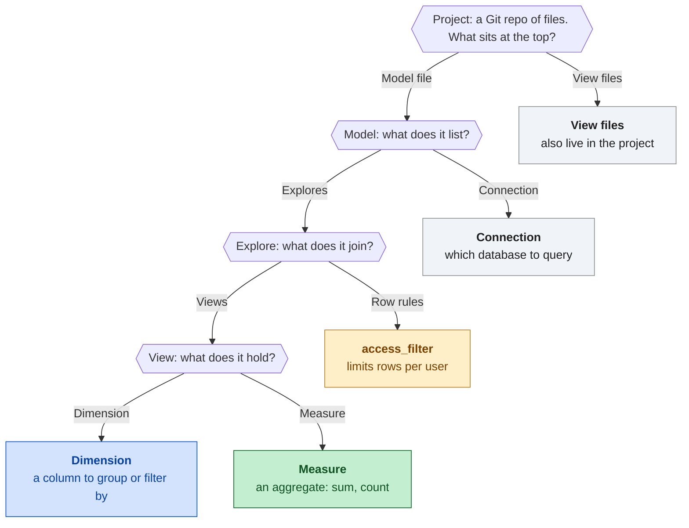
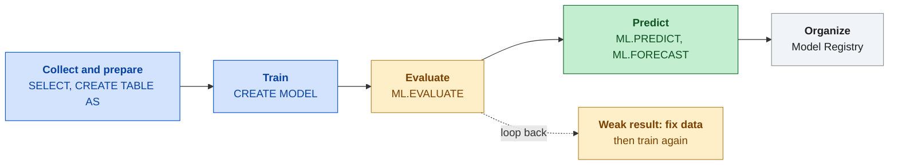

# Domain 2: Analysis and presentation

Part of the [handbook](README.md). Practice questions and the interactive version: [ADP Study Hub](https://claude.ai/artifact/BKoxgMe73TZksDEshXkXGY).

**In this chapter**

- [Ways to work with BigQuery data](#s-bq-access)
- [SQL you must be able to read](#s-sql)
- [Nested and repeated data: RECORD, REPEATED, UNNEST](#s-nested)
- [BigQuery cost and speed: partitioning, clustering, views](#s-cost-speed)
- [Looker and Data Studio](#s-looker)
- [LookML in plain words](#s-lookml)
- [The steps of an ML project](#s-ml-project)
- [BigQuery ML](#s-bqml)
- [The AI options ladder](#s-ai-options)

<a id="s-bq-access"></a>

## Ways to work with BigQuery data

BigQuery holds the data, and five tools reach it. Pick by the job. The console (BigQuery Studio) is the web page for clicking around and writing SQL. `bq` is a command-line tool that comes with the Google Cloud CLI, good for scripts and loads. A client library lets an application in Python, Java, Go and other languages call BigQuery. A Colab Enterprise notebook is a hosted Jupyter notebook inside BigQuery Studio, for analysis you can rerun, with charts and notes. BigQuery DataFrames (`bigframes.pandas`) gives you pandas-style Python, but BigQuery does the computing, so a table larger than the notebook's memory is fine.

| Way | Best for | Weak for |
|---|---|---|
| Console | One-off SQL, exploring tables | Repeated automated work |
| `bq` command line | Scripts, loads, quick admin | Visual exploration |
| Client library | Apps and services that query or load | Ad hoc looking around |
| Colab Enterprise notebook | Python analysis with charts, rerunnable | Dashboards for people who do not code |
| BigQuery DataFrames | Pandas-style code on very large tables | Tiny files on your laptop |
| Share a notebook | Share, then add people or groups as Code Owner, Editor or Viewer | Emailing the file around |

> [!WARNING]
> **Common trap.** Plain pandas copies the whole table into the notebook's memory, so a huge table fails. BigQuery DataFrames looks the same but keeps the work inside BigQuery.

> [!TIP]
> **Tip.** People you share a notebook with also need rights to run notebooks and to read the tables it uses, such as the Notebook Runtime User role plus BigQuery Data Viewer and BigQuery Job User (both are explained in the IAM section).

**Read more in the Google Cloud docs**

- [Introduction to notebooks in BigQuery](https://docs.cloud.google.com/bigquery/docs/notebooks-introduction)
- [Share notebooks](https://docs.cloud.google.com/bigquery/docs/manage-notebooks)
- [BigQuery DataFrames overview](https://docs.cloud.google.com/bigquery/docs/bigquery-dataframes-introduction)

<a id="s-sql"></a>

## SQL you must be able to read

SQL runs in a different order from the one you write: FROM and joins, WHERE, GROUP BY, HAVING, SELECT with window functions, QUALIFY, ORDER BY, LIMIT. That order explains most rules. WHERE filters rows before grouping, so it cannot see `COUNT(*)`. HAVING filters groups after grouping, so it can. QUALIFY filters after window functions, so it can use `ROW_NUMBER`.

A JOIN pairs rows by a key. If the other table has several rows per key, the first row repeats once per match. This is fan-out, and a SUM of the repeated column comes out too high. Fix it by reducing the many side to one row per key before you join.

A window function calculates across related rows but keeps every row, unlike GROUP BY. `PARTITION BY` inside `OVER()` only splits rows into groups for that calculation. It is not table partitioning, which is how storage is laid out (see [cost and speed](#s-cost-speed)).

Paid revenue per region, keeping only regions above 10,000:

```sql
SELECT region, SUM(amount) AS revenue
FROM sales.orders
WHERE status = 'paid'          -- rows, before grouping
GROUP BY region
HAVING SUM(amount) > 10000     -- groups, after grouping
ORDER BY revenue DESC;
```

The latest row for each customer (newest first, keep number 1):

```sql
SELECT customer_id, email, updated_at
FROM crm.customer_updates
WHERE email IS NOT NULL
QUALIFY ROW_NUMBER() OVER (
  PARTITION BY customer_id
  ORDER BY updated_at DESC) = 1;
```

A running total and yesterday's value:

```sql
SELECT sale_date, daily_sales,
  SUM(daily_sales) OVER (ORDER BY sale_date) AS running_total,
  LAG(daily_sales) OVER (ORDER BY sale_date) AS prev_day
FROM sales.daily_totals
ORDER BY sale_date;
```

`LEAD` is the same as `LAG` but reads the next row.

| You need | Write |
|---|---|
| Filter rows | `WHERE` |
| Filter on `COUNT` or `SUM` | `HAVING` |
| Filter on `ROW_NUMBER` | `QUALIFY` |
| Latest row per key | `ROW_NUMBER() ... ORDER BY ... DESC`, keep 1 |
| Running total | `SUM(x) OVER (ORDER BY ...)` |
| Compare with the previous row | `LAG(x)` |
| Number or rank inside groups | `PARTITION BY` in `OVER` |
| Rows from both tables | `JOIN ... ON key` |

> [!WARNING]
> **Common trap.** Leaving out `DESC` in the latest-row query keeps the oldest row, not the newest. Putting an aggregate such as `COUNT(*) > 1` in WHERE is an error: it belongs in HAVING.

**Read more in the Google Cloud docs**

- [Query syntax and clause order](https://docs.cloud.google.com/bigquery/docs/reference/standard-sql/query-syntax)
- [Window function calls](https://docs.cloud.google.com/bigquery/docs/reference/standard-sql/window-function-calls)

<a id="s-nested"></a>

## Nested and repeated data: RECORD, REPEATED, UNNEST

JSON often has things inside things, and BigQuery can keep that shape. A **RECORD** (also called STRUCT) is one object with sub-fields, like a customer with a name and a city. **REPEATED** (also called ARRAY) is a list, many values in one cell. A list of objects is a REPEATED RECORD. In the JSON, `{...}` is a RECORD and `[...]` is REPEATED. Newline-delimited JSON loads these shapes with an ordinary load job.

Our example is order 7 with three items. You reach a RECORD field with a dot: `customer.city`. A list must be unpacked first with `UNNEST`, which gives one row per item. Then the dot works on each item.

**Before and after UNNEST**

**Stored: 1 row**

| order_id | customer.city | items |
|---|---|---|
| 7 | Toronto | pen x2, ink x1, pad x4 |

- customer is a RECORD
- items is REPEATED

**After UNNEST: 3 rows**

| order_id | sku | qty |
|---|---|---|
| 7 | pen | 2 |
| 7 | ink | 1 |
| 7 | pad | 4 |

- One row per item
- Order data repeats

*One order with three items becomes three rows, and the order data repeats on each.*

```sql
SELECT o.order_id, o.customer.city, item.sku, item.qty
FROM shop.orders AS o, UNNEST(o.items) AS item;
```

| Piece | Meaning | How you write it |
|---|---|---|
| RECORD | One object with sub-fields | `customer.city` |
| REPEATED | A list in one cell | `UNNEST(o.items) AS item` |
| REPEATED RECORD | A list of objects | `item.sku` after the UNNEST |
| Comma before UNNEST | Orders with an empty list drop out | `LEFT JOIN UNNEST(...)` keeps them |
| Count orders | One row per order | `COUNT(*)` before UNNEST |
| Count items | One row per item | `COUNT(*)` after UNNEST |

> [!WARNING]
> **Common trap.** `SELECT o.items.sku` fails because a list has no single `sku`. After UNNEST every row is one item, so `COUNT(*)` now counts items, not orders.

**Read more in the Google Cloud docs**

- [Work with arrays](https://docs.cloud.google.com/bigquery/docs/arrays)
- [Specify nested and repeated columns](https://docs.cloud.google.com/bigquery/docs/nested-repeated)

<a id="s-cost-speed"></a>

## BigQuery cost and speed: partitioning, clustering, views

On-demand BigQuery bills for the data a query reads, not for the rows it returns. Two table layouts cut what is read. **Partitioning** splits a table into slices by a date, timestamp, datetime or integer column, and you cannot add it to an existing table. **Clustering** sorts the rows by up to four columns. Neither helps unless the query filters on that column. Skipping slices is partition pruning. A `LIMIT` does not cut the data read on an ordinary table.

**Partitioning vs clustering**

| Partitioning | Clustering |
|---|---|
| Splits table by one column | Up to 4 sort columns |
| Query reads only matching slices | Query skips non-matching blocks |
| Set at table creation | Helps filters on those columns |
| Blocks a filtered query touches: skip skip **read** skip skip skip | Blocks a filtered query touches: skip **read** skip **read** skip skip |

*Both save money only when the WHERE clause uses the column you chose.*

Three ways to reuse a result differ in freshness and speed. A standard view is a saved query that runs every time. A materialized view stores the result and BigQuery keeps it current. A scheduled query writes a table that is only as new as its last run.

**View, materialized view, scheduled table**

|  | Fresh data | Fast reads | Who keeps it current | Stores results |
|---|---|---|---|---|
| **Standard view** | Yes | No, reruns each time | Nothing to keep | No |
| **Materialized view** | Yes | Yes | Google, automatically | Yes |
| **Scheduled-query table** | Only as of last run | Yes | You, with a schedule | Yes |

*Fresh and fast with no upkeep points to a materialized view.*

| You need | Use |
|---|---|
| Queries filter on a date | Partition by that date column |
| Queries filter on customer or country | Cluster by those columns |
| Same aggregation, new rows all day, must be current | Materialized view |
| Hide columns or share a saved query | Standard view |
| A heavy report that can be a little old | Scheduled query into a table |
| Know the cost before running | Dry run, or the estimate in the console |
| Read less data | Pick only the columns you need |

> [!WARNING]
> **Common trap.** Adding `LIMIT 10` feels cheaper, but the full table is still read and billed. A filter on the partitioning column is what reduces the bytes.

**Read more in the Google Cloud docs**

- [Introduction to partitioned tables](https://docs.cloud.google.com/bigquery/docs/partitioned-tables)
- [Introduction to clustered tables](https://docs.cloud.google.com/bigquery/docs/clustered-tables)
- [Materialized views](https://docs.cloud.google.com/bigquery/docs/materialized-views-intro)

<a id="s-looker"></a>

## Looker and Data Studio

**Looker** is the enterprise BI product. A data team writes the metric definitions once in LookML, so every dashboard shows the same number. Access is set inside Looker: content sits in folders, people get View or Manage Access, Edit rights on folders, roles decide what they can do, and user attributes (a value stored per person or group, such as a store number) feed an `access_filter` that limits rows. **Data Studio (used to be Looker Studio)** is a free drag-and-drop report tool for self-service work. Looker and Data Studio are different products.

**Looker vs Data Studio**

| Looker | Data Studio |
|---|---|
| Data team writes LookML once | Anyone builds, drag and drop |
| Folders and roles control access | No cost, many data sources |
| access_filter limits rows per user | Owner's credentials share data |
| One definition for every dashboard | Fast for one-off reports |

*Governed and shared across a company: Looker. Quick and self-service: Data Studio.*

To build in Looker, save an Explore as a new dashboard or create one in a folder, add tiles and filters, then give people access to that folder.

| Question | Looker | Data Studio |
|---|---|---|
| Who builds | Data team models, then users explore | Anyone, by drag and drop |
| Metric definitions | Once, in LookML | Per report |
| Row-level limits | `access_filter` with a user attribute | Only if the source enforces them and viewer's credentials are used |
| Sharing | Folder access for the people who need it | Share the report with people |
| Data seen by viewers | Their own Looker access | Owner's data if owner's credentials are used |
| Cost | Licensed | No cost |
| Pick it when | Governed metrics, many teams | A quick one-off or mixed sources |

> [!WARNING]
> **Common trap.** A Data Studio data source set to owner's credentials shows the owner's data to every viewer, even those with no access to the table. Use viewer's credentials when each person should see only what they are allowed to.

**Read more in the Google Cloud docs**

- [Looker and Data Studio comparison](https://docs.cloud.google.com/looker/docs/studio-comparison)
- [How dashboard access works in Looker](https://docs.cloud.google.com/looker/docs/access-control-and-permission-management)
- [Data credentials in Data Studio](https://docs.cloud.google.com/looker/docs/studio/data-credentials)

<a id="s-lookml"></a>

## LookML in plain words

LookML is the code the data team writes to describe the data once. A **project** is a Git repo of LookML files. A **model** file picks the database connection and lists the explores. A **view** describes one table as fields. A **dimension** is a field you group or filter by, such as a name or date. A **measure** is an aggregate such as `type: sum` or `type: count`. An **explore** is what users start from in Looker, and a **join** inside it links views.

**How LookML pieces nest**



*Follow the answers down: project, model, explore, view, field.*

A view with a dimension and a measure:

```
view: order_items {
  sql_table_name: shop.order_items ;;
  dimension: sale_price {
    type: number
    sql: ${TABLE}.sale_price ;;
  }
  measure: total_revenue {
    type: sum
    sql: ${sale_price} ;;
  }
}
```

An explore that joins a second view:

```
explore: order_items {
  join: users {
    sql_on: ${order_items.user_id} = ${users.id} ;;
    relationship: many_to_one
  }
}
```

A simple change is editing one parameter: set `type: average` instead of `sum`, or add `label: "Revenue"`. In the Explore, a **custom field** adds SQL to the query, and a **table calculation** works on the rows already returned. Both are made in the Explore without editing LookML.

| Word | Plain meaning |
|---|---|
| Dimension | A column to group or filter by |
| Measure | A number that adds up, by `sum` or `count` |
| Explore | The starting point users query |
| Join | Links two views inside an explore |
| LookML measure | Defined once, every user sees it |
| Custom field | Quick extra field, part of the query |
| Table calculation | Spreadsheet-style math on returned rows |
| `access_filter` | Row rule on an explore, from a user attribute |

> [!WARNING]
> **Common trap.** A table calculation only sees the columns already in the results, so it cannot become a shared metric. For a revenue number everyone reuses, write a measure in LookML.

**Read more in the Google Cloud docs**

- [LookML terms and concepts](https://docs.cloud.google.com/looker/docs/lookml-terms-and-concepts)
- [Table calculations](https://docs.cloud.google.com/looker/docs/table-calculations)
- [access_filter](https://docs.cloud.google.com/looker/docs/reference/param-explore-access-filter)

<a id="s-ml-project"></a>

## The steps of an ML project

A standard ML project has four steps. First you **collect and prepare data**: gather rows, clean them, and choose the columns that will predict the answer. Second you **train**: the model learns patterns from the **training data**. Third you **evaluate**: you score the model on **test data**, rows it never saw, to learn how it will do on new cases. Fourth you **predict**: you run the finished model on new rows. A weak result sends you back to the data. **Model Registry** in Agent Platform (used to be Vertex AI) is the central place to organize models, with versions and deployment to an endpoint.

**An ML project, step by step**



*Each step has a BigQuery ML statement, and a weak result loops back to the data.*

| Step or term | Meaning | In BigQuery ML |
|---|---|---|
| Collect and prepare | Clean rows, pick features, split data | `SELECT`, `CREATE TABLE AS` |
| Train | Learn from the training data | `CREATE MODEL` |
| Evaluate | Score on test data the model never saw | `ML.EVALUATE` |
| Predict | Run the model on new rows | `ML.PREDICT`, `ML.FORECAST` |
| Overfitting | The model memorized the training rows, so it fails on new ones | Good training score, poor test score |
| Data leakage | A feature holds information you will not have at prediction time | Great evaluation, poor production |
| Model Registry | One place to version, compare and deploy models | `model_registry` option or `ALTER MODEL` |

> [!WARNING]
> **Common trap.** A near perfect evaluation score is a warning, not a win: look for a feature that is only known after the outcome, such as a cancellation reason in a model that predicts cancellation. Remote models cannot be registered in Model Registry.

> [!TIP]
> **Tip.** When rows are ordered in time, test on the most recent period, not on randomly chosen rows.

**Read more in the Google Cloud docs**

- [Introduction to AI and ML in BigQuery](https://docs.cloud.google.com/bigquery/docs/bqml-introduction)
- [Register BigQuery ML models in Model Registry](https://docs.cloud.google.com/bigquery/docs/managing-models-vertex)
- [ML workflow on Agent Platform](https://docs.cloud.google.com/vertex-ai/docs/start/introduction-unified-platform)

<a id="s-bqml"></a>

## BigQuery ML

BigQuery ML trains and runs models with SQL on data already in BigQuery, so nothing is exported. `CREATE MODEL` picks the algorithm with `model_type`. A **label** is the column holding the known answer for past rows, named in `input_label_cols`. Rows with a label suit supervised models. Rows with no label suit clustering (`KMEANS` groups similar rows) or a pretrained model.

`ML.EVALUATE` scores a model, `ML.PREDICT` applies it to new rows, and `ML.FORECAST` returns future values from a time-series model. `ML.FORECAST` takes no input table, only a horizon, for example `STRUCT(30 AS horizon, 0.8 AS confidence_level)`.

A **remote model** points at a model hosted elsewhere, such as Gemini in Agent Platform (used to be Vertex AI). You create it with `REMOTE WITH CONNECTION` and an `ENDPOINT` option. The connection is a Cloud resource connection in the dataset's region, and its service account needs the Agent Platform User role (`roles/aiplatform.user`). Then `AI.GENERATE_TEXT` sends a `prompt` column to Gemini and returns text. `ML.GENERATE_TEXT` is the older function for the same job, with different output column names, and Google now recommends `AI.GENERATE_TEXT` for new queries. You may see either name.

```sql
CREATE OR REPLACE MODEL `shop.churn_model`
OPTIONS (model_type = 'LOGISTIC_REG',
         input_label_cols = ['churned']) AS
SELECT tenure_months, monthly_spend, plan_type, churned
FROM `shop.customers_history`;

SELECT customer_id, predicted_churned, predicted_churned_probs
FROM ML.PREDICT(MODEL `shop.churn_model`,
  (SELECT customer_id, tenure_months, monthly_spend, plan_type
   FROM `shop.customers_current`));
```

| You want | Use | Note |
|---|---|---|
| A number (price, sales) | `LINEAR_REG` | Label is numeric |
| A category (yes or no, one of many) | `LOGISTIC_REG` | Label is a class |
| A category or number, harder patterns | `BOOSTED_TREE_CLASSIFIER`, `BOOSTED_TREE_REGRESSOR` | Decision trees |
| Groups, with no labels | `KMEANS` | Set `num_clusters` |
| A forecast over time | `ARIMA_PLUS` | Then `ML.FORECAST` |
| To score a model | `ML.EVALUATE` | No table: uses held-back rows |
| Answers for new rows | `ML.PREDICT` | Keeps your extra columns |
| Gemini from SQL | Remote model, `AI.GENERATE_TEXT` (older: `ML.GENERATE_TEXT`) | Needs the connection role |

> [!WARNING]
> **Common trap.** "Group customers into segments" with no labeled answer is clustering (`KMEANS`), not `LOGISTIC_REG`. A remote model also fails until its connection's service account has the Agent Platform User role.

> [!NOTE]
> **Beyond the exam guide.** Other model types exist: `MATRIX_FACTORIZATION` for recommendations, `PCA` to shrink the number of columns, and imported TensorFlow, ONNX and XGBoost models trained elsewhere.

**Read more in the Google Cloud docs**

- [Introduction to AI and ML in BigQuery](https://docs.cloud.google.com/bigquery/docs/bqml-introduction)
- [Predict with linear regression (CREATE MODEL, ML.EVALUATE, ML.PREDICT)](https://docs.cloud.google.com/bigquery/docs/linear-regression-tutorial)
- [Forecast with ARIMA_PLUS](https://docs.cloud.google.com/bigquery/docs/arima-single-time-series-forecasting-tutorial)
- [Generate text with a remote Gemini model](https://docs.cloud.google.com/bigquery/docs/generate-text-tutorial)

<a id="s-ai-options"></a>

## The AI options ladder

There are four ways to get a model, by effort. **Pre-trained APIs** (Vision, Speech-to-Text, Natural Language, Translation) are finished models you call, with no training. **BigQuery ML** trains on table data with SQL. **AutoML** in Agent Platform (used to be Vertex AI) trains on your labeled tabular or image data with few clicks. **Custom training** means you write the code. Going down gives more control for more effort, so stop at the first rung that works.

To choose, ask: do you have labels, what is the data type, and does the team write SQL or code? Gemini fits open-ended work such as summaries and drafting. A specialized API fits one fixed question and returns the same structure every call.

**The AI options ladder**

Top row: Least effort, least control. Bottom row: Most effort, most control.

|  | What it is | Note |
|---|---|---|
| **Pre-trained APIs and Gemini** | Call a finished model | no data |
| **BigQuery ML** | SQL on data in BigQuery | SQL |
| **AutoML** | Your labels, Google picks the model | clicks |
| **Custom training** | Your code and model design | code |

*Start at the top and move down only when the rung above cannot do the job.*

| Situation | Pick |
|---|---|
| A common task (translate, transcribe, detect objects), no training data | Pre-trained API |
| Summarize or write text, no training | Gemini |
| Gemini over rows in BigQuery | Remote model, `AI.GENERATE_TEXT` (older: `ML.GENERATE_TEXT`) |
| Labeled table in BigQuery, SQL team | BigQuery ML |
| No labels, you want groups | BigQuery ML `KMEANS` |
| Labeled images or tables, little code | AutoML |
| Full control of the model code | Custom training |

> [!WARNING]
> **Common trap.** Training your own model when a pre-trained API already does the job, or reaching for AutoML when a SQL team can train inside BigQuery. Pick the simplest rung that meets every requirement in the question.

> [!NOTE]
> **Beyond the exam guide.** Custom training means writing code in a framework such as TensorFlow, PyTorch or scikit-learn and running it as a training job in Agent Platform, in a prebuilt or custom container. Use it only when AutoML and BigQuery ML cannot express the model you need.

**Read more in the Google Cloud docs**

- [ML workflow and training options on Agent Platform](https://docs.cloud.google.com/vertex-ai/docs/start/introduction-unified-platform)
- [Introduction to AI and ML in BigQuery](https://docs.cloud.google.com/bigquery/docs/bqml-introduction)

---

Previous: [Domain 1: Data preparation and ingestion](01-data-preparation-and-ingestion.md) | Next: [Domain 3: Pipeline orchestration](03-pipeline-orchestration.md)
