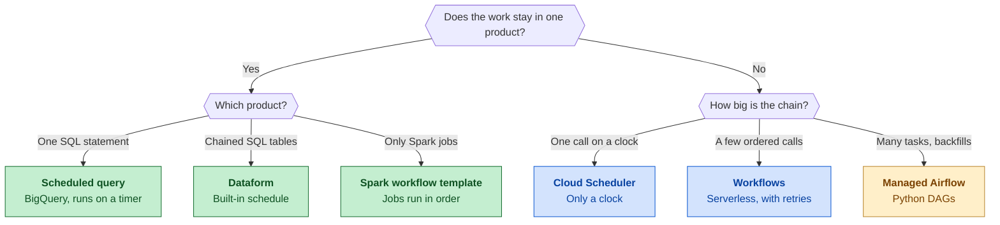
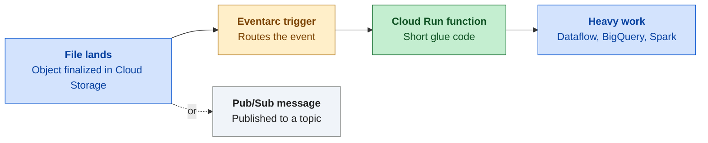

# Domain 3: Pipeline orchestration

Part of the [handbook](README.md). Practice questions and the interactive version: [ADP Study Hub](https://claude.ai/artifact/BKoxgMe73TZksDEshXkXGY).

**In this chapter**

- [Picking a scheduler or orchestrator](#s-orchestrators)
- [Event-driven pipelines: Eventarc and Cloud Run functions](#s-event-driven)
- [Watching and fixing pipelines](#s-monitoring)

## Picking a scheduler or orchestrator

Pick the smallest tool that covers the whole job. A **scheduled query** runs SQL in BigQuery on a timer. **Dataform** builds chained SQL tables in order and has its own schedule. **Managed Service for Apache Spark workflow templates (used to be Dataproc workflow templates)** run Spark jobs in order, on a cluster the template can create and delete or on an existing one. **Cloud Scheduler** is only a clock: it sends an HTTP call or a Pub/Sub message. **Workflows** chains API calls with retries and needs no servers. **Managed Service for Apache Airflow (used to be Cloud Composer)** runs Python DAGs in an environment you pay for. A DAG is a list of tasks plus the order they must run in. Use it when several products are chained with dependencies, waits or backfills (re-running the schedule for past dates that were missed).

**Which orchestrator?**

*Start with the work, then pick the smallest tool that covers it.*

| Tool | Pick it when | Skip it when |
|---|---|---|
| Scheduled query | One SQL statement on a timer | Steps depend on each other |
| Cloud Scheduler | You need a clock for any HTTP target | You need steps or retries between steps |
| Dataform | Many SQL tables built in order, with Git | The work is not SQL in BigQuery |
| Spark workflow template | Only Spark jobs, in order | Other products take part |
| Workflows | A few API or service calls in order, serverless | You need backfills or many linked tasks |
| Managed Airflow | Many products, dependencies, backfills | One product's own scheduler is enough |

> [!TIP]
> **Tip.** Words like "simplest" or "least operational overhead" point to the product's own scheduler. Words like "backfill" or "several products" point to Airflow.

> [!WARNING]
> **Common trap.** Managed Airflow can do every job in the table, so it looks safe. When the whole job lives in one product, that product's own scheduler wins and Airflow is overkill.

**Read more in the Google Cloud docs**

- [Schedule queries in BigQuery](https://docs.cloud.google.com/bigquery/docs/scheduling-queries)
- [Workflows overview](https://docs.cloud.google.com/workflows/docs/overview)
- [Schedule Dataform runs](https://docs.cloud.google.com/dataform/docs/schedule-runs)

## Event-driven pipelines: Eventarc and Cloud Run functions

An event-driven pipeline starts when something happens, not at a set time. **Eventarc** is the router. It watches a source, for example Cloud Storage reporting that an object was finalized (a new file finished uploading), and sends that event to a destination such as a Cloud Run function (used to be Cloud Functions), a Cloud Run service or Workflows. The function runs a short piece of code, such as starting a Dataflow job or a load. A Pub/Sub topic can be the source too: the trigger fires for each message published. Choose events when files arrive at unpredictable times. Choose a schedule when data arrives at known times.

**File lands, function runs**

*An event moves through the router to a small function, which hands off the real work.*

| Need | Use |
|---|---|
| Run every night at 02:00 | Cloud Scheduler or a scheduled query |
| Process each file as soon as it lands | Eventarc trigger to a Cloud Run function |
| Run code for each Pub/Sub message | Eventarc Pub/Sub trigger |
| Pub/Sub straight into BigQuery, data unchanged | BigQuery subscription |
| Pub/Sub into BigQuery with changes on the way | Dataflow |
| Many steps after an event | Eventarc trigger to Workflows |
| Heavy processing after an event | The function only starts Dataflow, Spark or BigQuery |

> [!WARNING]
> **Common trap.** A job that checks the bucket every minute is polling, not event-driven: it runs when nothing arrived and reacts up to a minute late. Also, Eventarc only routes the event, it does not run your code.

**Read more in the Google Cloud docs**

- [Eventarc overview](https://docs.cloud.google.com/eventarc/docs/overview)
- [Route Cloud Storage events to Cloud Run](https://docs.cloud.google.com/eventarc/standard/docs/run/route-trigger-cloud-storage)
- [Pub/Sub triggers for Cloud Run](https://docs.cloud.google.com/run/docs/triggering/pubsub-triggers)

## Watching and fixing pipelines

Four tools, four jobs. **Cloud Monitoring** stores metrics, draws dashboards and sends an alert when a metric crosses a limit you set. **Cloud Logging** keeps log entries that you search in the Logs Explorer to find the actual error message. The **Dataflow job UI** has a job graph that shows each step with its own numbers, so you can spot the slow one. For streaming jobs it also shows data freshness (how far processing lags behind the event times) and system latency (the longest time any item has waited or been in process). A **dead-letter topic** is a second Pub/Sub topic that receives messages a subscription failed to deliver after a set number of tries, from 5 to 100.

| Question | Tool |
|---|---|
| Tell me when the backlog grows | Cloud Monitoring alerting policy |
| Show the trend over the last week | Cloud Monitoring dashboard |
| What was the exact error? | Cloud Logging, Logs Explorer |
| Which step is slow? | Dataflow job graph |
| Is the stream falling behind? | Dataflow data freshness, system latency |
| Keep the messages that keep failing | Dead-letter topic |

> [!WARNING]
> **Common trap.** A dead-letter topic only catches messages Pub/Sub could not deliver. If Dataflow receives a message fine but it fails your own checks, Pub/Sub never sees a failure, so write those records to an error table inside the pipeline.

**Read more in the Google Cloud docs**

- [Dataflow monitoring interface](https://docs.cloud.google.com/dataflow/docs/guides/using-monitoring-intf)
- [Pub/Sub dead-letter topics](https://docs.cloud.google.com/pubsub/docs/dead-letter-topics)
- [Alerting policies in Cloud Monitoring](https://docs.cloud.google.com/monitoring/alerts)

---

Previous: [Domain 2: Analysis and presentation](02-analysis-and-presentation.md) | Next: [Domain 4: Data management](04-data-management.md)
