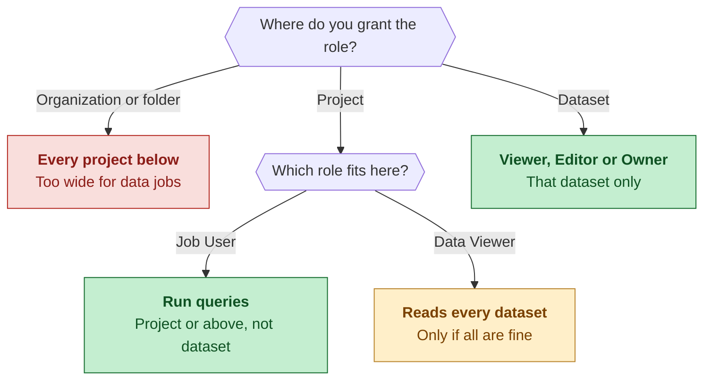
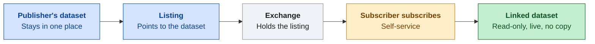

# Domain 4: Data management

Part of the [handbook](README.md). Practice questions and the interactive version: [ADP Study Hub](https://claude.ai/artifact/BKoxgMe73TZksDEshXkXGY).

**In this chapter**

- [IAM and least privilege](#s-iam)
- [Cloud Storage access control](#s-bucket-access)
- [Protecting data: rows, columns, tables](#s-protect)
- [Encryption and keys](#s-encryption)
- [Storage classes, lifecycle and expiration](#s-storage-classes)
- [Backup, recovery and replication](#s-recovery)
- [Sharing and finding data: BigQuery sharing, Knowledge Catalog](#s-sharing-catalog)

## IAM and least privilege

IAM decides who can do what on which resource. A **permission** is one allowed action. A **role** is a bundle of permissions that you grant to a principal (a user, group or service account). Grants flow down the hierarchy: organization, folder, project, resource. **Basic roles** (Owner, Editor, Viewer) are very wide and not meant for production data. **Predefined roles** are made by Google for one service. **Custom roles** are bundles you pick and maintain yourself. Least privilege means the smallest role, at the lowest level, that does the job. In BigQuery a query is a job, so running one needs **Job User** on the project, plus **Data Viewer** to read the data.

**Where a role is granted**

*Organization, folder, project, then dataset: the higher the grant, the wider the reach.*

| Role | What it allows | Granted at |
|---|---|---|
| BigQuery Job User | Run jobs, including queries | Project or above, not dataset |
| BigQuery Data Viewer | Read data and metadata, no changes | Project, dataset, table |
| BigQuery Data Editor | Viewer plus create and change tables | Project, dataset, table |
| BigQuery Data Owner | Editor plus delete the dataset and manage its access | Project, dataset, table |
| BigQuery Metadata Viewer | See resources and their access, no query of data | Project, dataset, table |
| Basic Viewer, Editor, Owner | Broad rights over many services | Project and above |

> [!WARNING]
> **Common trap.** Data Viewer alone cannot run a query, because that needs Job User. And Data Viewer granted on the project reads every dataset in it, so grant it on the one dataset when others must stay hidden.

**Read more in the Google Cloud docs**

- [Understand roles in IAM](https://docs.cloud.google.com/iam/docs/roles-overview)
- [BigQuery predefined roles](https://docs.cloud.google.com/bigquery/docs/access-control)
- [BigQuery basic roles](https://docs.cloud.google.com/bigquery/docs/access-control-basic-roles)

## Cloud Storage access control

A bucket uses one of two access models. With **uniform bucket-level access**, only IAM controls access, for the bucket and every object in it, so there is one place to audit. With **fine-grained** access, IAM works together with **ACLs** (access control lists, a permission list on one single object), so one object can differ from the rest. Google recommends uniform. You can switch it off again only during the first 90 days. **Public access prevention** is a separate switch that blocks grants to `allUsers` and `allAuthenticatedUsers`, so nobody can make data public by mistake. A signed URL still works, so it is the way to give time-limited access to someone without a Google account.

**Bucket access models**

| Uniform | Fine-grained | Public access prevention |
|---|---|---|
| IAM only | IAM plus ACLs | Blocks allUsers |
| No object ACLs | One object can differ | Blocks allAuthenticatedUsers |
| One place to audit | Harder to audit | Works with either model |
| Recommended | Only if ACLs are needed | Signed URLs still work |

*Two access models, plus one switch that works on top of either.*

| Setting or role | What it does |
|---|---|
| Uniform bucket-level access | IAM only, ACLs switched off |
| Fine-grained access | IAM plus per-object ACLs |
| Public access prevention | Blocks public grants, either model |
| Storage Object Viewer | List and read objects |
| Storage Object Creator | Add new objects only, no read, overwrite or delete |
| Storage Object User | Read, create, update and delete objects |
| Storage Object Admin | Full control of objects |
| Storage Admin | Full control of objects and buckets |

> [!WARNING]
> **Common trap.** Uniform access removes ACLs, but IAM can still grant `allUsers`; only public access prevention blocks that. And Object Creator cannot read a file back.

**Read more in the Google Cloud docs**

- [Uniform bucket-level access](https://docs.cloud.google.com/storage/docs/uniform-bucket-level-access)
- [Public access prevention](https://docs.cloud.google.com/storage/docs/public-access-prevention)
- [Cloud Storage IAM roles](https://docs.cloud.google.com/storage/docs/access-control/iam-roles)

## Protecting data: rows, columns, tables

Match the protection to what you must hide. A **row-level access policy** is a rule on a BigQuery table: `GRANT TO` names who, `FILTER USING` says which rows they see, and anyone not named sees no rows. In **Looker**, an `access_filter` on an Explore (the screen where users build queries) limits rows using a **user attribute** (a value stored on each user, such as a store ID). Looker usually queries BigQuery as one shared service account, so BigQuery alone cannot tell its users apart. An **authorized view** shares the result of a query with people who have no access to the source tables. Those people need Job User on the project and Data Viewer on the view's dataset.

**Which protection for which need**

|  | Hide rows | Hide a column | Show part of a value | Share a subset |
|---|---|---|---|---|
| **Row-level policy** | Yes | No | No | No |
| **Looker access_filter** | Yes, in Looker | No | No | No |
| **Policy tag (beyond guide)** | No | Yes | No | No |
| **Masking (beyond guide)** | No | Null value | Yes | No |
| **Authorized view** | In SQL | In SQL | In SQL | Yes |

*Read across a row to see what each protection can do.*

> [!NOTE]
> **Beyond the exam guide.** A policy tag locks one column: only holders of Fine-Grained Reader on the tag can read it, and everyone else still queries the other columns. Dynamic data masking builds on policy tags and shows readers with Masked Reader a changed value, such as null, a hash, or only the first or last four characters.

| Need | Use |
|---|---|
| Different rows for different people in BigQuery | Row-level access policy |
| Different rows per person in Looker | `access_filter` with a user attribute |
| Share part of a table with people who lack table access | Authorized view |
| Hide one column, keep the table working | Policy tag (beyond the guide) |
| Show part of a value, like the last digits | Dynamic data masking (beyond the guide) |
| Stop a bucket from ever being public | Public access prevention |

> [!WARNING]
> **Common trap.** A BigQuery row-level policy filters by who runs the query. Looker usually runs every query as the same service account, so use `access_filter` there.

**Read more in the Google Cloud docs**

- [Row-level security in BigQuery](https://docs.cloud.google.com/bigquery/docs/row-level-security-intro)
- [Authorized views](https://docs.cloud.google.com/bigquery/docs/authorized-views)
- [access_filter in LookML](https://docs.cloud.google.com/looker/docs/reference/param-explore-access-filter)

## Encryption and keys

Encryption at rest protects data stored on disk. Encryption in transit protects data moving over a network, using TLS, which scrambles the traffic so anyone listening sees noise. Google Cloud does both by default, so you switch nothing on. The only choice is who holds the key that locks stored data. With **Google-managed keys (GMEK)**, Google creates, stores and rotates the key. With **customer-managed keys (CMEK)**, you create the key in **Cloud KMS** (Cloud Key Management Service) and rotate, disable or destroy it yourself. With **customer-supplied keys (CSEK)**, you keep the key outside Google and send it with each request. Only some services accept CSEK, such as Cloud Storage. BigQuery does not.

**Encryption: who holds the key**

Top row: Google holds the key. Bottom row: You hold the key.

|  | What it is | Note |
|---|---|---|
| **GMEK, Google-managed** | Default, no setup, Google rotates | default |
| **CMEK, customer-managed** | Your key in Cloud KMS | you control |
| **CSEK, customer-supplied** | Your key outside Google | Cloud Storage, not BigQuery |

*Moving down the ladder, you hold more of the key work and Google holds less.*

| Option | Who holds the key | Works with | Pick it when |
|---|---|---|---|
| GMEK | Google | Every service, default | No rule says you must control keys |
| CMEK | You, in Cloud KMS | BigQuery, Cloud Storage, Cloud SQL and more | You must rotate, disable or audit the key |
| CSEK | You, outside Google | Cloud Storage and a few others, not BigQuery | The key must never be stored in Google Cloud |
| At rest | The disk copy | All stored data | Always on |
| In transit | The network path | Traffic to Google APIs | Always on, TLS |

You attach a CMEK key where the service lets you: a Cloud Storage bucket, or a BigQuery table. In BigQuery you can also set a default key on a dataset (it applies to tables created afterwards, not existing ones) or on a project (it protects query results).

> [!WARNING]
> **Common trap.** CMEK and CSEK both mean "my own key", but CMEK keeps the key in Cloud KMS inside Google Cloud, and CSEK does not. If the question says the key must stay outside Google Cloud, that is CSEK, and it cannot be BigQuery.
> [!NOTE]
> **Beyond the exam guide.** To encrypt single columns inside a BigQuery table with keys you control, you can use the AEAD functions in SQL together with Cloud KMS. The exam guide does not list this.

**Read more in the Google Cloud docs**

- [Cloud Storage encryption options](https://docs.cloud.google.com/storage/docs/encryption)
- [BigQuery customer-managed keys](https://docs.cloud.google.com/bigquery/docs/customer-managed-encryption)
- [Cloud KMS overview](https://docs.cloud.google.com/kms/docs/key-management-service)

## Storage classes, lifecycle and expiration

A Cloud Storage class trades storage price against access price and time. The colder the class, the cheaper to store, but you pay a retrieval fee and a minimum storage time: delete early and you still pay for the rest. A **lifecycle rule** is a condition (such as an age in days) plus an action (delete, or move to a colder class). **Autoclass** moves objects for you by watching access: objects nobody reads cool down to colder classes, and a read moves an object back to Standard, with no retrieval fee. In BigQuery you set an expiration on a table, a partition, or a dataset default (new tables only). A table or partition left unmodified for 90 days drops to a cheaper long-term storage price on its own. Reading does not reset that clock; writing does.

**Storage classes and lifecycle**

Top row: Frequent access. Bottom row: Rare access.

|  | What it is | Note |
|---|---|---|
| **Standard** | No minimum, no retrieval fee | hot |
| **Nearline** | 30 days, about monthly reads | after 30 days |
| **Coldline** | 90 days, about quarterly reads | after 90 days |
| **Archive** | 365 days, under yearly reads | then delete |

*A lifecycle rule moves objects down this ladder after N days, and a final rule can delete them.*

| Need | Use |
|---|---|
| Read often, or kept only a few days | Standard |
| Read about once a month | Nearline, 30 day minimum |
| Read about once a quarter | Coldline, 90 day minimum |
| Read less than once a year | Archive, 365 day minimum |
| Unknown or changing access pattern | Autoclass |
| Delete or cool files after N days | Lifecycle rule on the bucket |
| Nobody may delete for years | Retention policy, locked with Bucket Lock |
| Drop old BigQuery tables or days | Table, partition or dataset default expiration |

> [!WARNING]
> **Common trap.** A colder class is not always cheaper. Data that is read all the time costs more in Nearline or Coldline because of retrieval fees, and deleting early still bills the minimum days.

**Read more in the Google Cloud docs**

- [Cloud Storage classes](https://docs.cloud.google.com/storage/docs/storage-classes)
- [Object Lifecycle Management](https://docs.cloud.google.com/storage/docs/lifecycle)
- [BigQuery storage best practices](https://docs.cloud.google.com/bigquery/docs/best-practices-storage)

## Backup, recovery and replication

Match the fix to the problem. In Cloud SQL, **automated backups** run on a schedule and **on-demand backups** run when you ask; each restores the database as of that backup. **Point-in-time recovery** adds the transaction log (a record of every change, called the binary log in MySQL) to replay changes up to a moment you pick, always into a new instance. **High availability** keeps a standby in another zone of the same region and fails over by itself, but the standby cannot serve reads. A **read replica** is a separate read-only copy that takes read load, can sit in another region, and can be promoted by hand. In Cloud Storage, versioning and soft delete bring back deleted or overwritten objects, and a dual-region bucket survives losing a region.

**Recovery map: problem and fix**

|  | Cloud SQL | Cloud Storage |
|---|---|---|
| **Data deleted by mistake** | Point-in-time recovery | Soft delete or versioning |
| **Zone outage** | High availability, auto failover | Regional bucket spans zones |
| **Region outage** | Cross-region replica, promote | Dual-region or multi-region |
| **Too many reads** | Read replica | Not a recovery issue |

*Pick the row that matches the problem, then read across to the product.*

| Feature | Fixes | Does not fix |
|---|---|---|
| Backup (automated or on demand) | Data loss, bad change | Changes after the backup |
| Point-in-time recovery | Bad change at a known minute | Needs backups and the log turned on |
| High availability | Zone outage, automatic | A deleted row (the standby copies it) |
| Read replica | Heavy reads, region loss if promoted | Automatic failover, mistakes |
| Object versioning | Overwrites and deletes | Region loss |
| Soft delete | Deletes and overwrites, 7 days by default | Anything older than the retention window |
| Dual-region bucket | Region loss, no action needed | Deleted objects |
| Turbo replication | 15 minute replication target, dual-region only | Deleted objects |

> [!WARNING]
> **Common trap.** High availability and replicas copy your mistakes too. A delete reaches the standby and the replica within moments, so only a backup or point-in-time recovery brings the rows back.
> [!NOTE]
> **Beyond the exam guide.** BigQuery has its own undo. Time travel lets you query a table as it was earlier, within a window of 2 to 7 days (7 by default), and a table snapshot keeps a read-only copy of a table at one moment until you delete it or its optional expiry passes.

**Read more in the Google Cloud docs**

- [Cloud SQL backups](https://docs.cloud.google.com/sql/docs/mysql/backup-recovery/backups)
- [Cloud SQL high availability](https://docs.cloud.google.com/sql/docs/mysql/high-availability)
- [Cloud Storage soft delete](https://docs.cloud.google.com/storage/docs/soft-delete)

## Sharing and finding data: BigQuery sharing, Knowledge Catalog

**BigQuery sharing (used to be Analytics Hub)** lets you publish a dataset once and let many subscribers use it without copying it. You put the dataset in a **listing**, inside an **exchange** (a container of listings). A subscriber subscribes and gets a **linked dataset** in their own project: a read-only pointer that always shows the current data. **Knowledge Catalog (used to be Dataplex)** is for your own data estate. It lets people search for tables and files, read their metadata, trace lineage (where a table came from), and run profile and quality scans.

**BigQuery sharing: publish once**

*The data stays in the publisher's project and subscribers query it live.*

| Need | Use |
|---|---|
| Give many partners live data, no copies | BigQuery sharing listing |
| See who subscribed to what you share | BigQuery sharing, publisher view |
| Find which table holds customer data | Knowledge Catalog search |
| See where a table's data came from | Knowledge Catalog lineage |
| Check null counts and value ranges | Knowledge Catalog profile scan |
| Pass or fail rules on a schedule | Knowledge Catalog quality scan |
| Move or transform data | Neither: Dataflow or Dataform |

> [!WARNING]
> **Common trap.** The two sound alike but point in opposite directions. BigQuery sharing sends data out to other projects or organizations. Knowledge Catalog helps you find and understand data you already have, and it shares nothing.

**Read more in the Google Cloud docs**

- [BigQuery sharing overview](https://docs.cloud.google.com/bigquery/docs/analytics-hub-introduction)
- [Knowledge Catalog overview](https://docs.cloud.google.com/dataplex/docs/introduction)
- [Data quality overview](https://docs.cloud.google.com/dataplex/docs/data-quality-overview)

---

Previous: [Domain 3: Pipeline orchestration](03-pipeline-orchestration.md) | Next: [Quick reference sheets](05-quick-reference.md)
